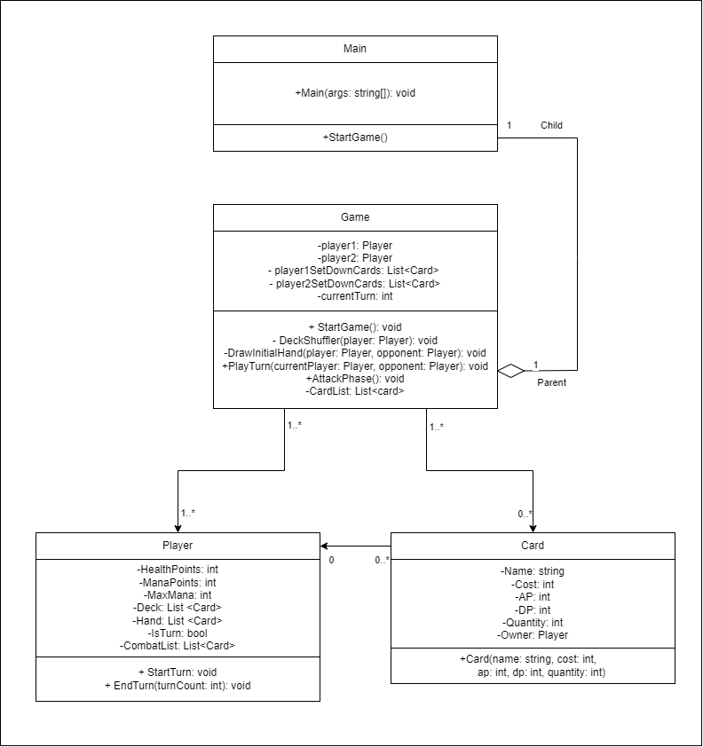

# Jogo de cartas
## Projeto 2 - Grupo 2 - https://github.com/trunksrage24/LP1Projeto2

O conceito do trabalho é fazer um Jogo onde existe três lâmpadas e três butões. 
O utilizador deve ligar todas as lâmpadas, no mínimo de turnos.

## Autores
__________________________________________________________
Trabalho feito para LP1 por:
  * João Sá Marques 22209640
    * Criação do Markdown; 6/6/2023
    * Atualização do Markdown; 26/5/2023
    * Código inicial; 26/5/2023
    * Update das cartas; 26/5/2023
    * Player; 26/5/2023
    * StartGame; 27/5/2023
    * DeckShuffler; 27/5/2023
    * DrawInitialHand; 27/5/2023
    * PlayTurn; 27/5/2023
    * SetDownCards; 27/5/2023
    * AttackPhase; 3/6/2023
    * Comentários XML; 4/6/2023
    * UML; 6/6/2023
    * Re-organização do projeto; 6/6/2023
    
  * Vitor Daniel, 22204782
    * Criação do Repositório; 26/5/2023
    * Código inicial; 26/5/2023
    * Card List; 26/5/2023

* João Carvalho, 22204909
    * review código e comentários 3/6/2023

__________________________________________________________
#### *Erros encontrados e desafios*
- A mana estava constantemente a falhar de fazer update no momento certo
- AttackPhase estava a ter problemas a tirar as cartass e também faze-las 
lutar.
- Lista cartas tinha problemas a dar cartas corretamente
- Fazer o MVC
- Estruturar o código

__________________________________________________________
## Arquitetura de Solução

1. Explicação ao Jogador
	- Introdução ao Jogador;

2. Inicialização do Jogo
	* O jogo demonstra as cartas tiradas para ambos os jogadores
	
	* Solicitação do Input de ambos os jogadores, um de cada vez;
		- Permite por cartas na batalha se tiver mana.
		
	* Condições de Vítoria e Perda
		- Caso um dos jogadores ter menos vida que o outro ou perder a vida 
		- toda ou terem a mesma vida e não tiverem mais cartas.

__________________________________________________________

## UML

__________________________________________________________

## Interpretação
1. Jogo de cartas
  - Dois jogadores, cada com 10 de vida e mana que aumenta +1 por turno até 
chegar a 5 máximo.
  - Uma fase onde os jogadores tiram cartas
  - Uma fase onde as cartas atacam
  - E dependendo da vida dos jogadores no fim, um ganha ou draw se ambos tiverem
a mesma vida.

__________________________________________________________
## Referências

* Nenhuma
