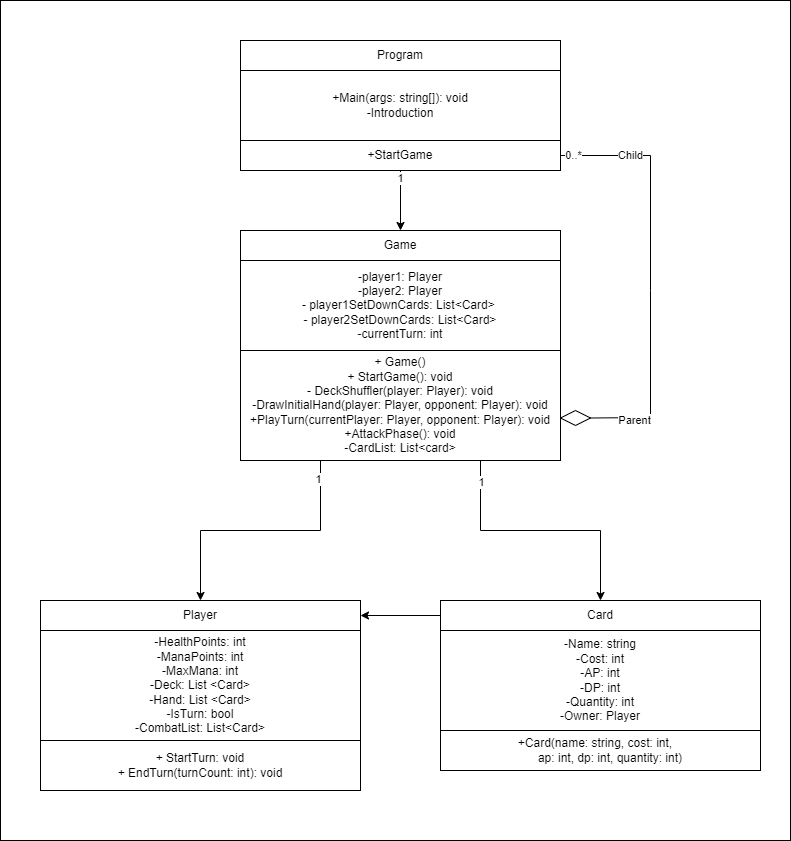

# Jogo de cartas
## Projeto 2 - Grupo 2 - https://github.com/trunksrage24/LP1Projeto2

O conceito do trabalho é fazer um Jogo onde existe três lâmpadas e três butões. 
O utilizador deve ligar todas as lâmpadas, no mínimo de turnos.

## Autores
__________________________________________________________
Trabalho feito para LP1 por:
  * João Sá Marques 22209640
    * Criação e atualização do Markdown
    * Código inicial;
    * Cartas;
    * Player;
    * StartGame;
    * DeckShuffler;
    * DrawInitialHand;
    * PlayTurn;
    * SetDownCards;
    * AttackPhase;
    * Comentários XML;
    
  * Vitor Daniel, 22204782
    * Criação do Repositório;
    * Código inicial;
    * Card List;

* João Carvalho, 22204909
    * UML;
    * review código e comentários

__________________________________________________________
#### *Erros encontrados e desafios*
- A mana estava constantemente a ter problemas e as cartas eram díficeis 
de lutarem umas com as outras.

__________________________________________________________
## Arquitetura de Solução

1. Explicação ao Jogador
	- Introdução ao Jogador;
	- Consentimento para Prosseguir.

2. Inicialização do Jogo
	* O jogo demonstra as cartas tiradas para ambos os jogadores
	
	* Solicitação do Input de ambos os jogadores, um de cada vez;
		- Permite por cartas na batalha se tiver mana.
		
	* Condições de Vítoria e Perda
		- Caso um dos jogadores ter menos vida que o outro ou perder a vida 
		- toda ou terem a mesma vida e não tiverem mais cartas.

__________________________________________________________

## Fluxograma

__________________________________________________________
## Referências

* Nenhuma
